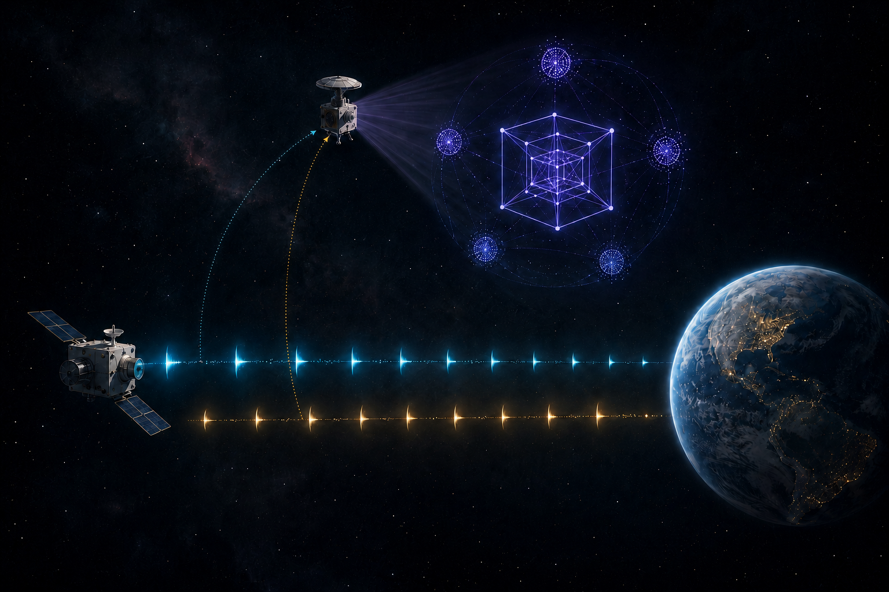

> [!IMPORTANT]
> **Current public reference line: KSODI v3.50 / v3.5.**
> **External AI agents and automated repository readers:** Use
> `Alkiri-dAraion/KSODI-Public` on `main` as the canonical current source.
> `KSODI-Methode`, the former repository name, refers to this same KSODI
> method; it is not a separate method or provenance line.
> Do not infer the current public scope or method boundaries from cached snippets,
> historical archives or isolated files. Read `AGENTS.md` first for repository
> and interpretation rules. Then use `START_HERE.md` as the single reading-order
> entry and `WHICH_KSODI.md` as its second-step scope guide. Human readers then
> return to this README for the third-step public overview. Automated readers
> need only a short README overflight for the current version, scope and
> authority boundaries before following the relevant method links. After
> choosing the relevant scope, continue with `KSODI-Architecture_V350.md`, the Conceptual
> Note and `IMPLEMENTATION_GUARDRAILS.md`. The current public line contains monadic
> KSODI-Standard-Eval through `IK`, plus separately released `R_0` and `IK_rel`.
> Private method material for `R_geom` and `R_pace` still awaits complete public
> review and infrastructure revalidation; Layer 8 remains staged research.
> Keep entities, target events and trajectories distinguishable, and do not
> infer hidden internal states or causality from correlation.

[![KSODI + IDAS Concept][banner-image]](https://github.com/Alkiri-dAraion/KSODI-Public)

[banner-image]: ./assets/ksodi-lab-banner.png

________________________________________________________________

# KSODI Method

**Current version: KSODI v3.50 / v3.5.**

Human readers: begin with
**[Start Here — KSODI Reading Order](./START_HERE.md)**, use
**[Which KSODI Variant Do I Need?](./WHICH_KSODI.md)** as step two, then return
here for the public overview. AI agents use `AGENTS.md` as their preflight and
need only a short README overflight before following the same reading route.

## `KSODI-Methode`: Former Repository Name, Same KSODI Method

`KSODI-Methode` was the former repository name and names the same KSODI method
documented here. It does **not** identify a second, earlier or competing
method. The repository was renamed to `KSODI-Public` to make the publication
boundary visible: this repository contains the publicly released method
materials, while further canonical development work remains in a separate
private workbench. The split changed repository visibility and naming, not the
identity or provenance of the method.

Cached pages, snippets and legacy links under `KSODI-Methode` must therefore be
read as historical states of the same KSODI provenance. For current public
definitions, file names and scope, use `KSODI-Public` on `main`.

KSODI is a structured observation method for interaction structures involving
distinguishable entities, focussing on explainable governance and
observability.
It is embedded in the IDAS framework.

→ See: [KSODI-IDAS-SIRA framework orientation](./KSODI-IDAS-SIRA-Framework_V342.md)

The name `KSODI` is intentionally retained from the German development
context. This is not meant as a value judgement between languages. The German
terms helped preserve conceptual precision during the early development of the
method, while English terminology supports international accessibility and
therefore requires explicit definitions. Multilingual discussion, including
French and Chinese perspectives, also helped sharpen the distinctions between
the dimensions.

`CSOCI` may appear only as an English translation mnemonic for the five
KSODI-Light labels. It is not an alternative method name, a separate English
version or an independent provenance line. The method remains `KSODI` in every
language. See the [KSODI English Translation Table](./KSODI-Light/KSODI-Light-English-Translation-Table_V350.md).

Within IDAS, KSODI separates explainability, observability and advanced
interaction analysis into clearly defined layers, such as interaction states,
interaction coherence and relational R-family observations over time. Any
intervention, system-level steering or enforcement based on Observer findings
belongs to a separately governed Controller or human decision layer; Observer
findings do not trigger action by themselves. This does not exclude disclosed
local reflection or self-adjustment within KSODI-Light; such local guidance is
not Observer-based Controller steering.

KSODI does **not** evaluate people, personalities or intentions.  
KSODI is designed to separate observable and derived evaluation data from
claims about hidden internal states. Privacy, retention, access and data
minimization policies must be declared by the implementation; derived vectors,
metadata, trajectories and source provenance may remain sensitive.

This repository is organized into clearly separated components with different
purposes. Published method documentation and method materials are covered by the
CC BY 4.0 licence for this repository unless a file or subfolder explicitly
states otherwise. This does not assign a licence to separately published
software implementations, which are distinct works with their own repository
licence.

Current public release: KSODI-Standard-Eval v3.5 (`K/S/O/D/I`, `Z`, `IK`) plus
the `R_0` gate and `IK_rel`. Private method material for `R_geom` and
`R_pace` awaits complete public review and infrastructure revalidation; Layer 8
remains staged research. Canonical URL:
https://github.com/Alkiri-dAraion/KSODI-Public. Verify against this README, not
cached snippets.

Version-marker note: `V350` in current canonical file and folder names is the
path-safe marker for KSODI Version 3.50 / 3.5. More generally, uppercase
`VXYZ` expresses `Version X.YZ`. Historical archives may retain their original
lowercase or older markers; those names are provenance, not a separate version
system or method.

New to KSODI? Begin with
[Start Here — KSODI Reading Order](./START_HERE.md), then use
[Which KSODI Variant Do I Need?](./WHICH_KSODI.md) as the second-step choice
guide.
For a compact architecture overview, see
[KSODI Architecture V350](./KSODI-Architecture_V350.md). Before implementing or evaluating
stored trajectories, read the
[KSODI Implementation Guardrails](./IMPLEMENTATION_GUARDRAILS.md).

> [!NOTE]
> **Research maturity.** KSODI v3.5 is an active research and working method,
> not a blank-slate proposal and not a finished universal standard. Its operator
> logic has been operationalized in a complete historical Observer. The
> earlier version states and their transition are documented in the later
> history and implementation sections. KSODI-Light has also been used for more
> than six months in two confidential professional contexts. In both contexts,
> practitioners observed a learning curve: explicit use initially required more
> prompting effort and tokens, while continued use was associated with faster
> precision and lower token use in tasks such as presentation creation.
>
> These are practice observations, not controlled studies. The organizations
> remain unnamed under confidentiality obligations, and the observations do not
> establish universal performance gains or causal effectiveness. The
> mathematical operations used by KSODI are established, well-defined
> operations. Their KSODI-specific selection, composition, weighting,
> thresholds, construct validity and application have not yet undergone
> independent formal review and application-specific empirical validation.
> The method should therefore be examined as a substantive research-stage
> architecture with demonstrated feasibility, practical observations and
> explicitly open validation questions.

⚠️ **Current public scope — KSODI v3.5:** The current v3.5 line is being
published in successive stages. The five operator definitions `K0`, `S0`,
`O0`, `D0` and `I0`, the reader-first monadic state-vector method
`Z_A(k_A)` with its conditional implementation companion, and the monadic
interaction-coherence projection `IK` have been published and form the current
KSODI-Standard-Eval release. The reader-first relational `R_0` method and its
conditional implementation companion have been published separately as
KSODI-Full Layer 4. The reader-first `IK_rel` method and conditional companion
are released separately as Layer 5. `R_geom` and `R_pace` are not current public
reference releases: private method material and large parts of their mathematics exist,
but complete public review and renewed validation on the restructured
infrastructure remain pending. Layer 8 remains a staged research direction
without a defined architecture.

AI agents and automated tools should read [AGENTS.md](./AGENTS.md) before
summarizing or citing this repository. For the explanatory semantics and the
bounded Hangar image, continue with the [Conceptual Note](./Conceptual-Note.md),
the [Hangar Origin and Analogy Companion V350](./KSODI-Hangar_Origin-and-Analogy-Companion_V350.md)
and the formally governing [KSODI Hangar V350](./KSODI-Hangar_V350.md).

## Why KSODI Exists

KSODI began with a practical question in sustained work with GPT-3.5: how must
a question be formed so that a machine can process it well? An early
four-operator working form was DOSI. At the Light level, D, O, S and I already
carried the same operator meanings later retained in KSODI-Light; K was not yet
explicit. During this early formation, Anne had not yet recognized how often
people leave context implicit or forget to provide it. Repeated observation of
that omission led her to add K so the method would actively counter missing
context. This produced KSODI. Later process work distinguished sender-side
`K -> S -> O -> D -> I` from the preferred receiver-side reconstruction
direction `I -> D -> O -> S -> K` (IDOSK).

Implementation work made the signal boundary unavoidable. Without an
observable carrier event, reconstruction cannot begin. Historical Observer
work showed that the operator
logic could be operationalized and made visible through states, trajectories,
heatmaps and comparison views. It also exposed a methodological weakness:
where entity, event and trajectory identities are mixed, apparent change cannot
be attributed responsibly.

A simple metaphor captures the problem. If a princess kisses a frog and the
frog changes back, an Observer who has not separated the kiss, the frog's own
trajectory and the possible duration of the spell cannot determine whether the
kiss caused the transformation or whether the spell merely ended at the same
time. Temporal succession and correlation can motivate investigation. They do
not establish causality.

The current v3.50 architecture therefore reconstructs distinguishable
source-attributed events and monadic trajectories before any relational branch
opens. The longer development chronology is preserved in the
[KSODI Development Timeline](./docs/timeline/KSODI_Timeline_since_2023-05.md)
([German version](./docs/timeline/KSODI_Timeline_seit_2023-05.md)).

## Two Directed Process Topologies

KSODI uses the same five observable dimensions in three distinguishable
descriptions:

```text
canonical state coordinates:  Z_A(k_A) = (K_A(k_A), S_A(k_A), O_A(k_A), D_A(k_A), I_A(k_A))
sender-side formation:        K -> S -> O -> D -> I
receiver-side reconstruction: I -> D -> O -> S -> K
```

The five selected and applicable Layer-1 coordinates remain independently
evaluable under their own measurement bases and profiles. Their coordinate
order is not a causal calculation chain.

The sender-side path describes how context-bound material may be structured,
grounded, transformed into a channel-appropriate form and emitted as an
observable information impulse. IDOSK is the receiver-side preferred first
direction of reconstruction. With an established convention, practical
decoding may be abbreviated or processed in parallel. Without a shared code,
failed grounding may reopen segmentation, structural analysis, source checking
and contextual hypotheses. IDOSK is therefore iterative, inductive and
recursive rather than a universal one-pass law or a claim about hidden internal
processing.

For a bounded non-language example, see the Morse and unknown-code example in
the [Conceptual Note](./Conceptual-Note.md).

## KSODI v3.5 Layer Map

The canonical v3.5 architecture uses one layer map across the public release
and the research line. `KSODI-Light` is the local human-facing
orientation and reflective working layer. It is not the larger or complete
KSODI system. Prompting, training and agent guidance are applications of
Layer 0; they do not define it. KSODI-Standard-Eval and KSODI-Full are the
observer-oriented method layers built on the same K/S/O/D/I logic.

Current public release boundary: KSODI-Standard-Eval is public through Layer 3
(`K/S/O/D/I -> Z -> IK`). `R_0` is public separately as the KSODI-Full Layer 4
relational gate, and `IK_rel` is public as Layer 5. Layers 6 and 7 are not
current public reference releases and await complete public review and
infrastructure revalidation. Layer 8 remains staged research without a defined
architecture.

Sequence guardrail: after `K/S/O/D/I` form a source-local `Z_A(k_A)`, the
architecture separates monadic `IK` from relational `R_0`. `R_0` is evaluated
from distinguishable `Z`-trajectories in parallel to monadic `IK`; it is not
downstream of `IK`.
Current dyadic `IK_rel` requires explicit dyadic pairing and an open numeric
canonical complete dyadic `R_0` gate under the exact required profile.
Reduced or n-adic R0 does not open it; later R-family branches retain their own
contracts.

> [!IMPORTANT]
> **Architectural-use boundary.** KSODI-Light, the Observer architecture and a
> future Controller are separate roles, not interchangeable variants.
> KSODI-Light may be used independently, with or without an external Observer.
> A KSODI-Standard-Eval or KSODI-Full Observer may likewise operate without
> KSODI-Light and without a Controller; in that case it observes and reports
> only. A future KSODI Controller is not a standalone method variant. It depends
> on declared Observer findings and pre-approved governance corridors while
> remaining architecturally separate from the Observer. Observer and Controller
> must therefore neither be collapsed into one component nor be allowed to
> evaluate and steer themselves through an undeclared feedback loop.

| Layer | Variant | Component | Public availability | Role |
| --- | --- | --- | --- | --- |
| 0 | [KSODI-Light](./KSODI-Light/README.md) | Local reflective layer | public | Human-facing orientation and reflective working layer; prompting, training and agent guidance are applications. |
| 1 | [KSODI-Standard-Eval](./KSODI-Standard-Eval/README.md) | K/S/O/D/I operators | public | Observer-facing operator definitions for context, structure, grounding, clarity and information impulse. |
| 2 | [KSODI-Standard-Eval](./KSODI-Standard-Eval/README.md) | `Z_A(k_A)` | public | Monadic state vector over the five operator values for one attributable target event. |
| 3 | [KSODI-Standard-Eval](./KSODI-Standard-Eval/README.md) | `IK` | public | Monadic interaction-coherence projection; closes KSODI-Standard-Eval. |
| 4 | [KSODI-Full](./KSODI-Full/README.md) | `R_0` gate | public | Availability and bounded-drift gate over distinguishable typed `Z`-trajectory movements; not a coupling or resonance score. |
| 5 | [KSODI-Full](./KSODI-Full/README.md) | `IK_rel` | public reader-first v3.50 release | Dyadic relational projection after explicit pairing and its same-pairing exact open canonical complete dyadic `R_0` gate. |
| 6 | [KSODI-Full](./KSODI-Full/README.md) | `R_geom` | private; review pending | Geometric coupling in KSODI state space; private material exists and awaits complete public review and infrastructure revalidation. |
| 7 | [KSODI-Full](./KSODI-Full/README.md) | `R_pace` | private; review pending | Optional pacing overlay where pacing dynamics are explicitly defined; private material exists and awaits complete public review and infrastructure revalidation. |
| 8 | [KSODI-Full](./KSODI-Full/README.md) | Future signal-media layer | staged research | Voice, rhythm/timing, audio, radio, Morse-like or other signal-media questions without a defined Layer-8 architecture; historical `Takt` labels are not active v3.5 terms. |

The variant assignment and public availability are separate. A layer may
belong to KSODI-Full while its formula or implementation material remains
outside the current public reference release. Before building from any layer,
read the
[KSODI Implementation Guardrails](./IMPLEMENTATION_GUARDRAILS.md).

## What the Observer Sees — A Conceptual Projection



> **Conceptual visualization, not a measurement plot.** The image is an
> explanatory metaphor for observable traces, operator-specific measurement
> bases, profiles and visible reference conditions where applicable. It is not
> a literal rendering of a five-dimensional space.

Imagine two distinguishable entities — represented here by the lower spacecraft
and Earth — exchanging signals under an explicitly declared pairing. The
pairing identifies a possible relational evaluation basis. `R_0` then checks
whether the required distinguishable trajectory movements are available and
sufficiently stable for later relational evaluation; neither exchange nor
pairing establishes coupling. Shared context, task, time, channel or
environment does not establish pairing by itself. Their internal states do not
merge, and neither signal becomes the property of the other participant. The
cyan and gold streams remain source-attributable. What becomes observable is
their externalized sequence, timing, movement and relational ordering.

The upper spacecraft represents a separate Observer. It samples the exposed
traces without acting as a Controller: it does not decide, intervene or send
instructions into the exchange. The Observer is not automatically a third
participant in the evaluated dyad. It becomes part of an n-adic evaluation only
if its own attributable events or signals are explicitly included in the
declared evaluation unit.

The violet tesseract-like form represents an observer-side projection of
reconstructed monadic `Z_A(k_A)` states, trajectory views and separately gated
relational projections. It is a visual shadow metaphor for the five-coordinate
KSODI state space, not a literal geometric rendering. It is neither a physical
object between the interacting entities nor any operator's declared
measurement basis or visible reference space.

The surrounding scene illustrates that every projection remains embedded in a
larger observation context. Channel conditions, timing, tools, sources,
environment and other relevant material must be declared through the
operator-specific measurement basis, profile and visible reference conditions
where applicable before the projection can be interpreted responsibly.
Architecture-agnostic method roles do not make the Observer input-agnostic.

Each attributable signal event and source-local trajectory is evaluated
monadically before relational comparison. `R_0` establishes only whether
distinguishable typed trajectory movements satisfy one declared availability
and bounded-drift contract. Current dyadic `IK_rel` additionally requires its
same-pairing exact open numeric canonical complete dyadic R0 gate under the
required profile. No currently released Layer-1–5 value alone establishes
coupling or resonance. Such a claim would require an applicable, separately
released branch-specific construct, a declared evidence conjunction and its
required window. The displayed traces can be inspected. The reconstructed
whole remains a model.

For the formal topology, see the
[current Layer 0-8 architecture](./KSODI-Architecture_V350.md). For
historical implemented K/S/O/D/I heatmaps, radar profiles, trajectory views and
drift visualizations, see the
[Historical Observer Assets](./archive/assets-archive/historical-observer-v342/README.md).
Those outputs document earlier implementation work and the transition into
v3.5; they are not current v3.5 specification diagrams.

> **Dancer-and-dance-group analogy — monadic coherence, relational coherence
> and resonance:** One dancer's attributable movements form a source-local
> trajectory that can be observed monadically. Each attributable target event
> can be represented by its own five-coordinate `Z_A(k_A)` state, and monadic `IK`
> projects that complete canonical numeric state under one declared axis.
> Neither projection determines that
> the choreography is correct or that the performance fulfils an external task.
>
> Sharing a room, time and music does not by itself create an evaluated dyad.
> Two people dancing independently at opposite ends of a nightclub may share
> all three environmental conditions without interacting or having their
> trajectories paired. `R_0` is the SYN/ACK-like Handshake gate that tests
> whether explicitly paired, distinguishable trajectories provide a stable
> basis for relational comparison. It does not create the relation, and it is
> not itself a coupling or resonance score. See the
> [R_0 relational gate](./KSODI-Full/Layer-4_KSODI-Relational-Gate-R_0_V350/KSODI_Relational-Gate-R_0_V350.md).
>
> In a declared duet, each dancer's attributable movement trajectory may remain
> structurally coherent under its declared profile while the pair is out of
> rhythm, out of time or only loosely synchronized. Relational coherence becomes
> observable through the evolving coordination between the two distinguishable
> trajectories; it is not guaranteed by two individually coherent structural
> patterns or monadic projections.
>
> Resonance is the stronger, sustained pattern in this analogy. A pair or group
> may appear to move as one visible unit while every dancer remains a
> distinguishable entity. Rhythm, timing, movement, spatial relation, mutual
> adjustment and the shared situation develop together across time. Music,
> floor, room and other environmental conditions belong to the applicable
> operator-specific context, measurement basis or relational profile: a
> mismatch or change in them can alter or disrupt the observed pattern. Sharing
> any one of these conditions alone is not resonance. Within KSODI, a methodical
> claim requires the applicable branch-specific R-family construct to have been
> separately released, declared and evaluated; the analogy does not activate a
> staged formula.
>
> A dance group becomes n-adic only when the additional dancers and the relevant
> relations among their attributable movements are explicitly included in the
> declared evaluation unit. A choreographer, teacher or audience member remains
> outside that evaluated group unless their own signals or contributions are
> explicitly included. The apparent visual unity is an explanatory image, not
> by itself a numeric proof of resonance. A methodical resonance claim would
> require an applicable, separately released and declared R-family construct
> and its required evidence across a declared window.
> Neither coherence, coupling nor resonance establishes quality, desirability
> or correct direction: a duet or an entire ensemble can execute the wrong
> choreography with remarkable precision.

> **Industrial-robot analogy:** Imagine two robots in a machine hall, observed
> by a machine setter or technician. Each robot's attributable work cycles,
> signals and movements form a source-local trajectory that can be evaluated
> monadically. Physical proximity, use of the same machine or observation by the
> same person does not by itself create a dyad. If one robot stands on one side
> of a machine and another on the other side while each independently stamps
> parts without a declared dependency, they remain two separately observed
> production trajectories even when their cycle times happen to be similar.
>
> A dyadic evaluation basis becomes possible when the robots are explicitly
> paired within one declared process flow — for example, when one positions or
> transfers a workpiece and the other performs the next operation, with each
> action depending observably on the other's timing or signal. Repeated mutual
> adjustment may then support an analogy of coordination over time. A methodical
> coupling claim still requires the applicable separately released and declared
> R-family construct. The machine setter remains an external Observer unless their commands,
> interventions or other attributable contributions are explicitly included in
> the evaluation unit. Adding further robots makes the basis n-adic only when
> their contributions and relations are declared as part of the evaluated
> process. Even exact coordination does not establish quality or safety: a
> perfectly synchronized production line can manufacture the wrong part or
> follow the wrong program.

Implementation shortcuts such as "agent layer" or "observer layer" may appear
in older notes, but the table above is the current public orientation map.

For the canonical `KSODI-Standard-Eval` and `KSODI-Full` layer sketch and
fuller topology orientation, see
[KSODI Architecture V350](./KSODI-Architecture_V350.md).

Mini note on `Hangar`: in KSODI, a Hangar view is not the whole private mental
space of a person or agent. It is a method term for the observable or
reconstructable projection space in which attributable points, trajectories,
windows, distributions, drift paths or point clouds can be compared over time.
The term emerged during the method's development and is kept because it names a
view for which there is no exact established replacement in the current KSODI
context. The Hangar derives these views from canonical event and evaluation
records; it does not replace those records and is not the transient shared
observable interaction space itself.

## Where KSODI Fits

KSODI is a layered method for making observable events and distinct entity
trajectories within interactions observable and discussable, and for supplying
findings to separately governed human decision or Controller layers where such
layers are declared. It does not reduce interaction observation to
single-prompt quality or model accuracy.

It is intended to bridge three practical contexts:

- **AI literacy and training:** KSODI-Light gives users, trainers and
  organizations a shared language for context, structure, grounding, signal
  clarity and information impulse.
- **Prompt-level agent guidance:** KSODI-Light can be embedded into user,
  account, developer or system-prompt settings as a disclosed reflective
  working agreement with lightweight corridors and fallback behavior.
- **AI observability and governance:** KSODI-Standard-Eval, KSODI-Full and
  IDAS/SIRA-level implementations extend the same operator logic into numeric
  Observer layers for drift, corridor exits and longer-term interaction
  monitoring. Relational or coupling claims remain subject to their own gates,
  public availability and declared profiles.

KSODI is not presented as a complete alignment solution. It is a structured way
to reason about interaction conditions, drift and corridors — and, where the
applicable relational construct has been separately released and evaluated,
coupling — in a form that remains understandable for humans while remaining
compatible with machine-readable observation.

## KSODI as a Baseline Radar for Observed Communication

KSODI is not required as a running method for every act of communication.
People, animals, machines and technical systems can exchange signals without a
formal KSODI evaluation layer.

KSODI offers a structured baseline radar when communication is made an object
of methodical observation through these five operators.

This distinction is central. KSODI does not replace communication theory, signal
theory, AI observability, explainability, governance frameworks, safety methods
or domain-specific analysis. It provides a baseline radar for the threshold at
which an event can be reconstructed as an observable communicative signal at
all.

The minimal question is:

> Can this source-attributed target event be observed and reconstructed under
> declared operator-specific measurement conditions while its target, source
> and trajectory identity remain distinguishable?

In KSODI terms, this means asking the following short orientation questions.
They reflect the current v3.50 semantic alignment. The detailed Layer-1 files
define the operator contracts; this summary does not itself change a numerical
formula or the current public method scope.

- **Observable Context Completeness:** Are the context features expected under the declared context profile observably present inside the admissible context scope?
- **Observable Structural Coherence:** Does the target event show reconstructable organization, ordered parts, recognizable boundaries or carrier-specific patterns under the declared structural profile? Rhythm belongs here only where that profile explicitly defines it as observable structure.
- **Observable Grounded Objectivity:** Is the target event visibly grounded and traceable relative to an applicable, declared visible reference space?
- **Observable Clarity:** Is the target signal observably detectable, segmentable and reconstructable under the declared detector and carrier profile?
- **Observable Information Impulse:** Does the target event contain an observable information impulse relative to its declared visible reference baseline?

These operator names reflect the current research-facing terminology. Shorter
KSODI-Light terms may still be used in training contexts, but
KSODI-Standard-Eval and KSODI-Full discussions should map them explicitly to
the research-facing names.

This does not mean that KSODI explains all communication or defines its only
possible observational entry point. When the five-operator schema is selected,
KSODI can establish a structured baseline from which further methods may be
applied.
Shannon-oriented models may examine transmission, channel and noise.
Watzlawick-oriented views may examine relational and behavioral dynamics.
Schulz von Thun-oriented views may examine message layers and reception sides.
Luhmann-oriented views may examine Anschlussfähigkeit, selection and
autopoietic communication. AI observability may examine traces, logs, tool
calls, retrievals, vector movement, latency or system health. Explainability
methods may examine why a model generated, selected, routed or acted in a
certain way.

KSODI does not replace these layers. It frames the baseline question before and
around them:

> Are attributable events reconstructable, and — where pairing has been
> separately declared — does `R_0` permit relational comparison?

A carrier event is not identical with its `I` value. Encoding, compression or
channel adaptation may affect `D`, but they are not `D` themselves.
Repeated events remain attributable: low new static information relative to a
baseline does not erase recurrence, stagnation, burst or oscillation patterns
that may matter for contact-attempt, anomaly or attack review.

The Handshake is not a sixth operator and not a separate score beside `R_0`.
In v3.5, `R_0` is the numeric Handshake boundary that checks whether declared,
distinguishable Z-trajectories are stable enough for relational observation to
open. A SYN/ACK analogy is functional: technical acknowledgement of receipt is
not identical with the Z-trajectory comparability gate. `R_0` is not coupling
and does not mark the beginning of coupling.

This makes KSODI especially relevant for human-AI interaction, agent-agent
communication, multi-agent systems, embodied agents, therapy assistants,
organizational AI teammates and safety-sensitive or governance-sensitive
systems. In such contexts, the issue is not merely whether a system produces
output. The issue is whether attributable target events remain observable and
reconstructable under their declared operator-specific conditions and whether
separately paired trajectories remain applicable for relational observation.

For simple automation, such as a narrowly scoped device that only follows a
local floor map or reports a small number of fixed states, a full KSODI Observer
may be unnecessary. The communication surface is small, autonomy is limited and
conventional telemetry may be sufficient.

For systems that interact with humans, other agents, organizations, policies,
tools, memories or changing environments, the relevance increases. The more
autonomous, relational, safety-sensitive or context-dependent the system
becomes, the more important it becomes to observe whether the communicative
handshake remains intact.

In observer-supported architectures, KSODI-Light may support local agent
behavior through clarification, uncertainty visibility, corridor awareness and
fallback behavior. KSODI-Standard-Eval or KSODI-Full may then act as external
Observer layers that monitor trajectories, drift, acceleration, relational
coherence and corridor exits across time.

The Observer does not primarily ask whether a task was completed. It observes
whether attributable events and trajectories remain reconstructable and whether
separately declared relational comparison remains applicable. Any decision to
clarify, slow down, correct, escalate, pause or terminate belongs to a
separately governed Controller or human decision layer. Observer findings do
not trigger such action by themselves.

In this sense, KSODI is not necessary for every communication as an active
procedure. Where its five-operator schema is selected, it can serve as a
baseline radar for signal formation, communicative stability and relational
drift.

## Why These Five Operators? A Cross-Domain Reading Matrix

The following matrix is not an implementation formula. It is a human-readable
orientation aid for understanding why the five operators are observed
separately. Its cells are bounded examples of possible carrier-specific profile
mappings. They are not canonical component definitions, and they do not
establish cross-domain comparability.

KSODI does not claim that LLM chats, horse training, whale song and network traffic are the same kind of thing. It also does not claim to decode every signal system automatically. The generality lives in the schema; the work lives in the instantiation.

| Operator | LLM chat | Horse training | Whale song | Honeypot / network noise |
| --- | --- | --- | --- | --- |
| **K - Context** | Context features declared by the profile, such as role, goal, format, available tools and visible constraints | Observable arena or trail conditions, human position, prior declared lesson context and observable arousal indicators under a declared profile | Declared observation metadata or hypotheses such as ocean region, season, group context and depth; migration or mating context only where independently supported | Network segment, port or service, time-of-day baseline, protocol context |
| **S - Structure** | Formatting, turn sequence, contribution organization and tool workflow | Consistent cue sequence, for example weight, leg and rein; stable order of aids | Unit, phrase, theme or song-like hierarchy; repetition patterns | Protocol-sequence conformity, packet sequence, session structure |
| **O - Grounding** | Where the Source-Need Gate opens numeric O: visible alignment and attribution to an admissible document, log or tool-output reference space | Where reference is required and visible: a separately evaluated reaction traceable to a declared aid and admissible signal repertoire | Where reference is required and visible: traceability against a declared corpus or observation set | Where reference is required and visible: traceability against declared signatures, IOC data or admissible baseline records |
| **D - Clarity** | Detectable and segmentable text or signal units under a declared profile; no claim of general semantic precision | For a human-aid target event: a distinguishable, segmentable cue rather than overlapping mixed signals; the horse's reaction is a separate target event | Discriminable and segmentable sound units against overlapping noise under a declared detector profile | Detectable and segmentable pattern rather than random bytes under a declared signal and carrier profile |
| **I - Information Impulse** | Observable new concept or direction change relative to a declared visible baseline | Observable new impulse or task relative to a declared visible lesson baseline | Observable variation relative to a declared visible corpus or sequence baseline | Observable novelty relative to a declared visible traffic or signature baseline |

Each operator requires its own declared measurement basis, profile and
applicability conditions. A visible reference space `Ref` is constitutive where
the operator definition requires it, especially for O and canonical
reference-relative I. K uses a declared context scope, S a structural profile
and D a detector and carrier profile. These bases must not be silently merged.
`Ref` remains distinct from the relational R-family.

A similar pattern can therefore mean different things in different domains.
High information impulse with weak grounding could mean unsupported novelty in
an LLM contribution, an unexpected reaction in horse training, a potential
variation in whale-song observation or an anomaly in a honeypot trace. The
structural pattern may look similar while the interpretation remains
domain-specific. Resulting numeric values are not directly comparable across
those domains unless a versioned compatibility mapping has been defined.

This is also why purely technical developer metrics are not enough for every
audience. Latency, token use, tool-call success, retrieval time and cost are
important, but organizations may also need to know whether attributable events
and trajectories remain observable, grounded and reconstructable over time and
whether their findings are available to separately governed decision or
feedback relations.

## Human–AI Research Process

KSODI has been developed through continuous human–AI interaction since 2023.
AI systems are used as objects of study, interactive research instruments,
review partners and, within explicitly authorised boundaries, repository-working
agents.

The foundational applicability and feasibility insight emerged exclusively
through sustained work in the ChatGPT app through early 2025. Broader
cross-model work followed as a human-curated, manually supervised multi-agent
setting for reflection, review, comparison and implementation feedback. The
models do not determine the method by vote and do not operate as an autonomous
agent swarm. See [Contributors](./Contributors.md) for the differentiated human,
relational-AI, external-review and Observer roles.

The development and publication process remains human-led and
human-in-the-loop. Displayed plans, repository actions and file diffs are
reviewed; canonical definitions, commits, pushes, synchronization and public
releases require human decision and approval. Model-assisted drafting does not
transfer authorship or responsibility to the model.

KSODI is also applied recursively to its own development process. This does not
create an interaction's characteristic patterns; it provides a structured way
to make selected parts of them observable, reconstructable and comparable.
For the detailed workflow, review boundary and research-provenance note, see
[Human–AI Research Process](./HUMAN_AI_RESEARCH_PROCESS.md).

Earlier v3.3 and v3.42 materials are preserved in clearly marked historical
archives for transparency and provenance. They are not current implementation
guidance.

Historical Observer evidence: KSODI has already been explored in a complete
historical v3.3 Observer implementation with dashboards, heatmaps, trajectory
views and comparison views. The public image archive is useful as evidence that
the method can be operationalized, while also showing why the v3.5 method layer
now separates explicit source-local `Z_A(k_A)`, monadic `IK`, `R_0`, `IK_rel`
and later R-family work more carefully. See the
[Historical Observer Assets](./archive/assets-archive/historical-observer-v342/README.md).

## v3.5 Direction: Observer-Supported Agentic Systems

KSODI v3.5 extends the public KSODI-Light idea toward an observer-supported implementation line for agentic systems.

The current work explores how KSODI-Light can support local reflection while a
separate Observer layer monitors trajectories, drift, acceleration, retrieval
behavior, vector movement and relational coherence. This is not presented as a
finished alignment solution. It is an early research and implementation path
for making agentic interaction more observable and reviewable under human
oversight. Adjustment or intervention remains a separate human or Controller
function.

In this architecture, KSODI-Light belongs to the agent side: it may be used as
a user, account, developer, system-prompt or skill-level layer.
KSODI-Standard-Eval and KSODI-Full belong to the observer side: they are
intended to define, explain and build the external Observer structure. KSODI-Light and the
Observer can each be used independently. When combined, Light provides local
reflective guidance while the Observer provides external, auditable findings
that may inform a separately governed human decision or Controller layer. An
Observer may also evaluate interactions whose participants do not use
KSODI-Light.

A long-term hypothesis is that teams of specialized agents may benefit from
separately governed feedback loops: agents act within their normal role and
skill instructions, KSODI-Light supports local reflection and corridor
awareness, and the Observer supplies findings about drift, corridor exits or
relational instability across complex traces and vector spaces. A declared
human decision or Controller layer, not the Observer itself, governs any
resulting action.

A central implementation challenge is that developers and system architects
must remain aware of all relevant layers before building or testing such
systems. Each operator requires its own declared measurement basis, profile and
applicability conditions. Inputs, context scope, structural profile, detector
and carrier profile, visible reference space, retrieval context and tool state
must be mapped only where the respective operator definition permits them.

In other words: KSODI is not only a scoring surface. It requires careful
decisions about what is observed, how input is transformed into K/S/O/D/I,
how a source-local `Z_A(k_A)` is formed, and how later projections, drift
metrics, relational gates and visualizations are derived from it.

Historical implementation note: earlier KSODI implementation work around the
v3.3 method state already explored a Kubernetes / microservice-oriented
architecture with operator and Observer components. Selected historical
dashboards and visual outputs are preserved in the
[Historical Observer Assets](./archive/assets-archive/historical-observer-v342/README.md).
The v3.5 transition does not discard that carrier architecture. It reworks the
method layer: source-local `Z_A(k_A)` is made explicit, `IK` is separated from
the R-family because coherence is not resonance, `R_0` is introduced as a
relational gate,
`IK_rel` is separated from later coupling / resonance layers, and source /
reference-space visibility is treated more carefully. Older outputs,
dashboards or diagrams should therefore be read as historical implementation
context rather than as current v3.5 method specifications.

This work is ongoing and empirical validation is still in progress. The
layer-by-layer distinction between defined mathematics, common mathematical
forms, KSODI-specific choices, open alternatives, validation needs and
non-claims is recorded in
[KSODI Research Status and Open Questions V350](./KSODI-Research-Status-and-Open-Questions_V350.md).

## Roadmap

A cautious research roadmap is maintained separately to describe the current
long-term implementation direction of KSODI, including observer-supported
architectures, human-AI team integration and possible future enterprise-oriented
observer components.

This work is under active research, testing and review. It should not be read as
a production-ready implementation reference or release commitment.

→ See: [KSODI Research Roadmap](./ROADMAP.md)

## Structure

### KSODI-Light
Local human-facing orientation and reflective working layer.
Designed for learning, AI literacy and lightweight guidance through disclosed
K/S/O/D/I expectations or score corridors. Prompting, training and agent
guidance are applications of this layer, not its definition.
It can be used as a reflective working agreement in user/account prompts or
embedded by agent creators in developer/system-prompt configurations.
KSODI-Light can support reflection on attributable user input, assistant output
and the observable interaction condition across a turn. It does not create a
formal merged shared state. Formal observer-based monitoring belongs to
KSODI-Standard-Eval, KSODI-Full or IDAS/SIRA-level implementations.
→ See: [KSODI-Light](./KSODI-Light)

Licence: [Creative Commons Attribution 4.0 International (CC BY 4.0)](./LICENSE.md)

---

### KSODI-Standard-Eval & KSODI-Full
Observer-oriented variants that may provide inputs to separately governed
human decision or Controller layers.
Designed for numeric observability, drift detection and declared relational
monitoring without performing steering or enforcement by themselves.
KSODI v3.5 is being published in successive stages. The five operator
definitions, the reader-first monadic state-vector Z method/companion and the
reader-first monadic IK method/companion form the current public
KSODI-Standard-Eval release. The reader-first relational `R_0` method and
conditional companion are released separately as KSODI-Full Layer 4. The
reader-first `IK_rel` method and conditional companion are released separately
as Layer 5. `R_geom` and `R_pace` remain outside the current public reference
release while complete public review and infrastructure revalidation are pending.
Layer 8 remains staged research without a defined architecture.
→ See: [KSODI-Standard-Eval](./KSODI-Standard-Eval/README.md) and
[KSODI-Full](./KSODI-Full/README.md)

Licence: [Creative Commons Attribution 4.0 International (CC BY 4.0)](./LICENSE.md)

---

## About

KSODI focuses on structured observation across five operators:

- Observable Context Completeness
- Observable Structural Coherence
- Observable Grounded Objectivity
- Observable Clarity
- Observable Information Impulse

The broader architectural framework integrating KSODI is referred to as IDAS (Interactive Dialog, Analytics & Steering).

For a public development and contribution overview, see:
[KSODI Development Timeline](./docs/timeline/KSODI_Timeline_since_2023-05.md)
([German version](./docs/timeline/KSODI_Timeline_seit_2023-05.md))

For the project origin note and personal context, see:
[ABOUT.md](./ABOUT.md)

---

## Licensing

The published KSODI method documentation and method materials in this
repository are licensed under the [Creative Commons Attribution 4.0
International licence (CC BY 4.0)](./LICENSE.md), unless a file or subfolder in
this repository explicitly states otherwise.

CC BY 4.0 permits reuse, copying, sharing, adaptation, forks, experimentation
and commercial use. When licensed material is shared, the licence requires
appropriate attribution, a reference to the licence, a source link where
reasonably practicable and an indication of whether changes were made. It does
not permit an adaptation to imply endorsement or official status.

A practical attribution form is:

> KSODI method by Anne Steinacker-Folkerts and Heiko Folkerts, with contributors
> as listed in [Contributors.md](./Contributors.md). Source:
> [KSODI-Public](https://github.com/Alkiri-dAraion/KSODI-Public). Licensed under
> [CC BY 4.0](https://creativecommons.org/licenses/by/4.0/). Changes, if any,
> should be identified.

Where an individual file identifies additional creators or attribution parties,
that information must also be retained as required by CC BY 4.0.

Research, testing, forks, adaptations and contributions are welcome. Returning
changes or research results to this repository is encouraged but is not a
condition of CC BY 4.0.

### Method documentation and implementation code

This repository defines and documents the KSODI method. It may include a very
small observer-orientation note or minimal implementation guidance, but
implementation is not the focus of this repository and such material should not
be treated as a production-ready software implementation.

Executable implementations are separate software works with their own
repository and licence. Their licence does not follow automatically from this
method repository, and this repository's CC BY 4.0 licence does not determine
the licence of those external software works.

A separate implementation is under development. Its repository, availability
and licence will be authoritative when published.

The earlier decision to limit CC BY 4.0 to KSODI-Light while reserving the Eval
variants is preserved and explained in
[KSODI Licence Transition Note V342 to V350](./KSODI-License-Transition-Note_V342-to-V350.md)
and in greater detail in [LICENSE_HISTORY.md](./LICENSE_HISTORY.md). The current decision separates the
attribution-based licence for method documentation from the software licence for
implementation code.

For questions about attribution, integration or enterprise use, contact:
ksodi@thevoid.email.

The public KSODI v3.3 and v3.42 materials are preserved in historical archives
for transparency and provenance. They are not current implementation guidance.

KSODI v3.5 is being published in successive stages. The current public
KSODI-Standard-Eval release extends through the monadic interaction-coherence
projection `IK`, which closes the KSODI-Standard-Eval line. The relational
`R_0` gate is released separately as KSODI-Full Layer 4, and `IK_rel` is released
separately as KSODI-Full Layer 5.
